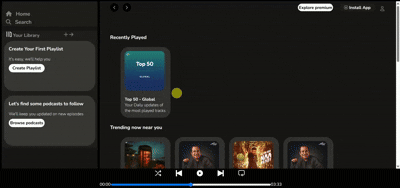
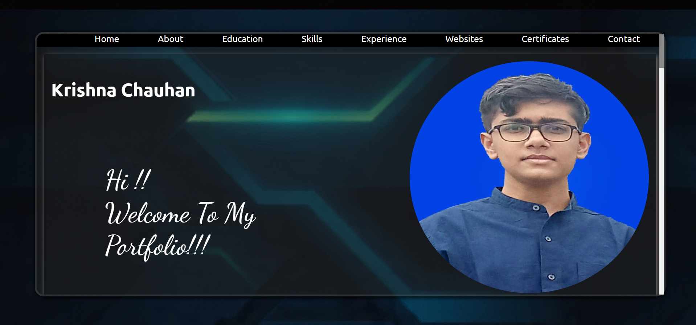
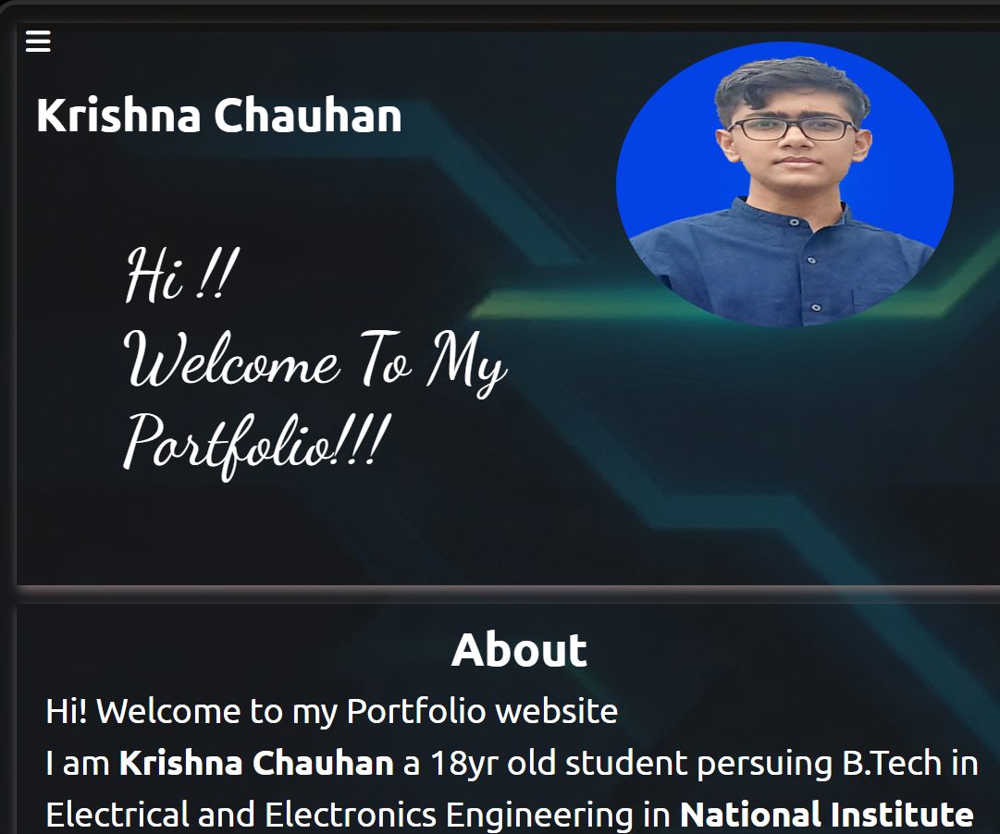
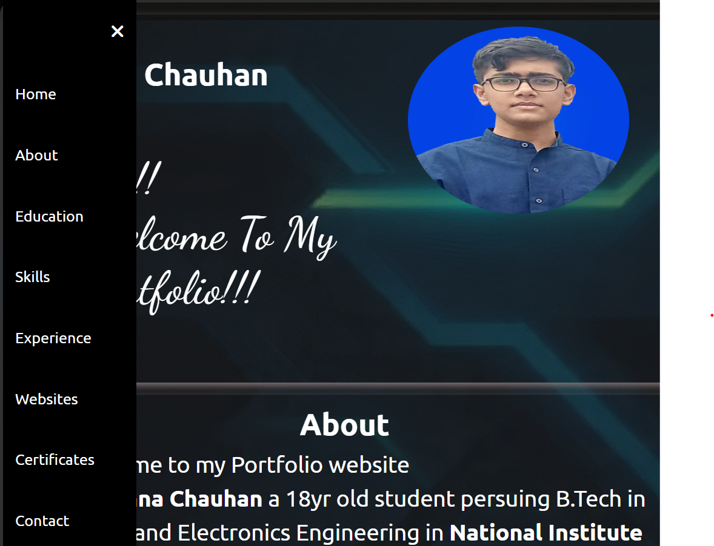
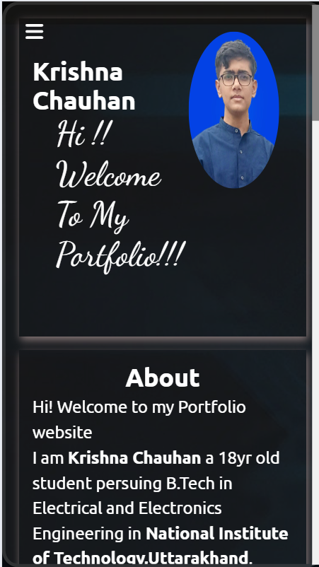
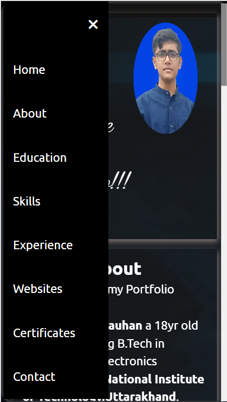

# 🌐 Personal Portfolio Website

This is my **second web development project**, built entirely using **HTML and CSS** — no JavaScript used.

It is a simple yet elegant personal portfolio website, showcasing my skills, projects, and background. This project helped me further improve my understanding of layout structuring, styling, and responsive design.

### 🔗 Live Demo

You can view the portfolio live at:  
**[https://krishnakc15.github.io/Portfolio](https://krishnakc15.github.io/Portfolio/)**

---

## 🛠️ Technologies Used

- HTML5
- CSS3
- Flexbox
- Responsive Design

---

## 📁 Folder Structure
Portfolio/

├── demo/ # Screenshots and demo video

├── images/ # Icons and image assets

├── index.html # Main HTML file

├── style.css # Main CSS file

└── README.md # Project description (this file)

---
### 📽️ Demo Video

## 📷 Demo Preview

Here are some quick previews from the `demo/` folder:

### Screenshot on Laptop

### Middle Screen Section Screenshots

### Mobile Screen Section Screenshots

---

## 🚀 What's Next?

- Improve responsiveness on smaller screens  
- Add animations/transitions  
- Eventually integrate JavaScript for more interactivity  

---

## 🙋‍♂️ About Me

I'm a upcoming second-year B.Tech student and an aspiring full-stack web developer.  
This is part of my journey in mastering frontend development.

Feel free to connect with me or check out my other projects!

---

## 📬 Contact

- GitHub: [@KrishnaKC15](https://github.com/KrishnaKC15)
- LinkedIn: https://www.linkedin.com/in/krishna-chauhan-1672b8345/
- Email: chauhankrishna705@gmail.com

---

## ⭐️ If you like this project...

Give it a ⭐️ on GitHub to support my learning journey!

